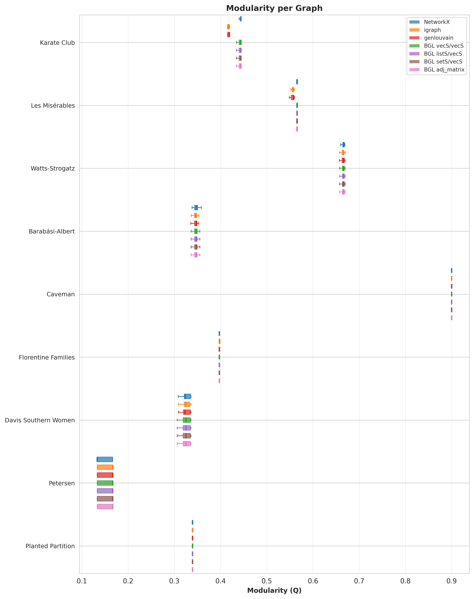
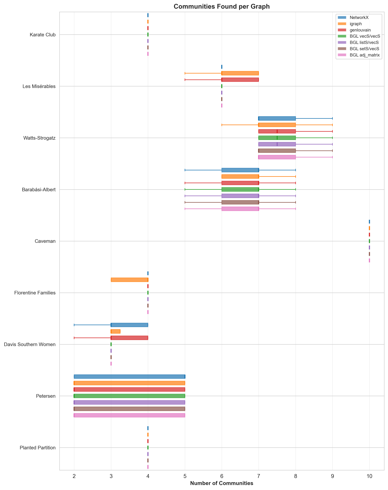
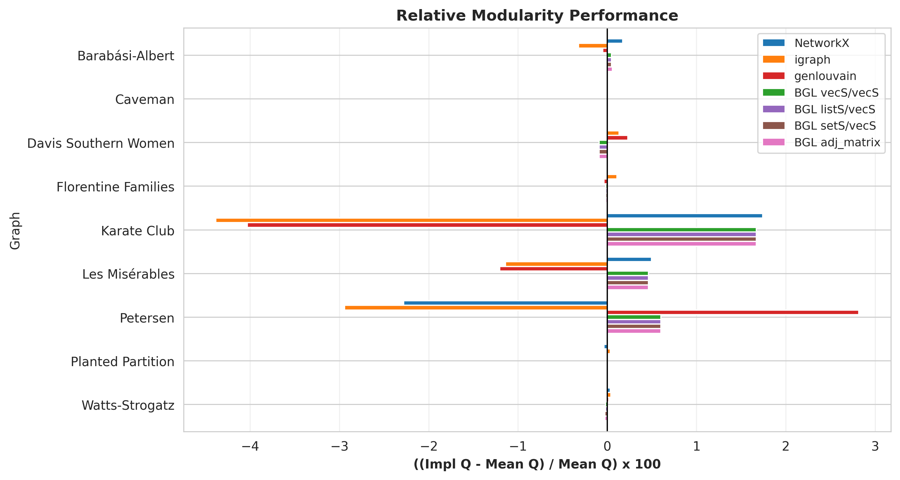
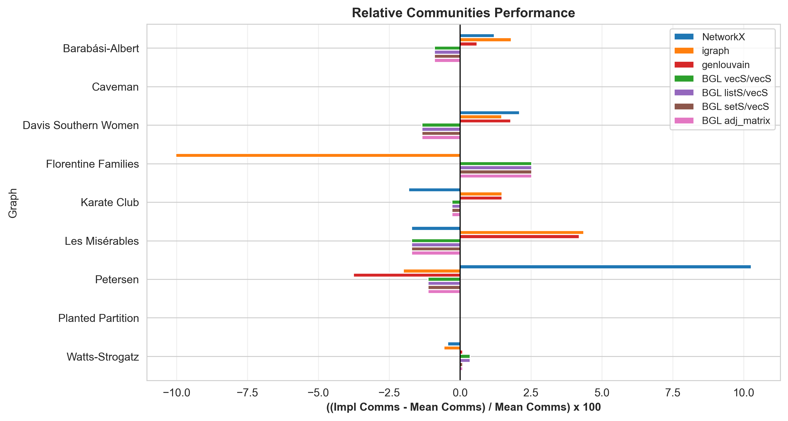
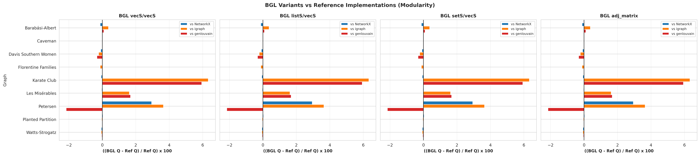
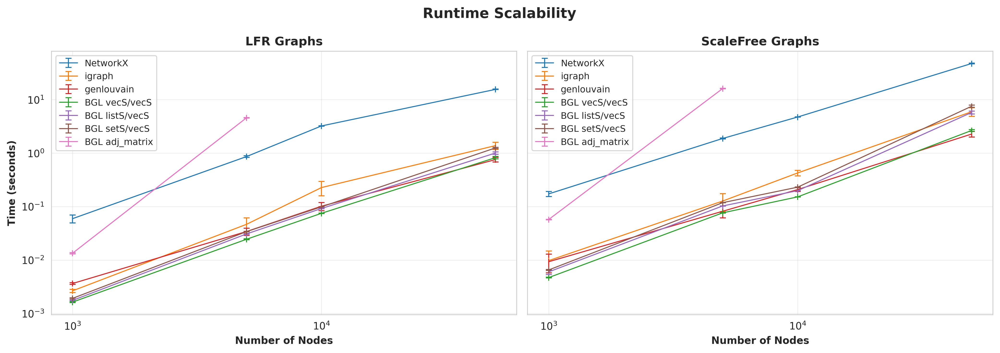
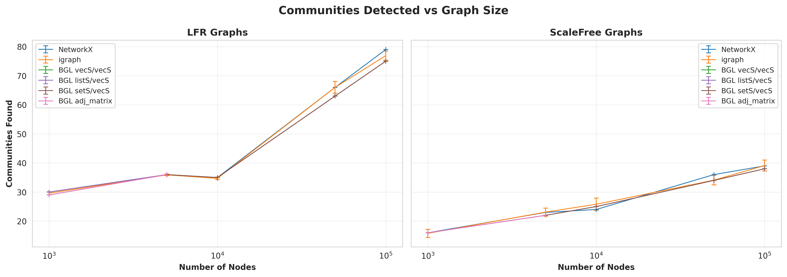
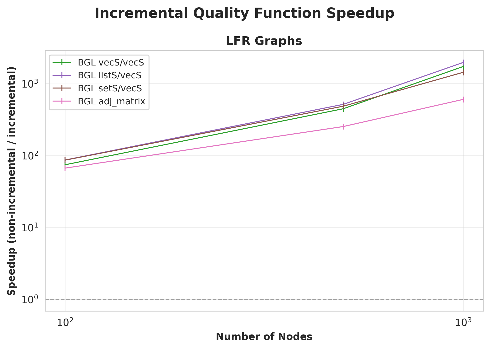
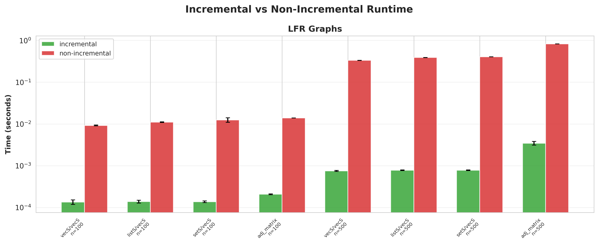
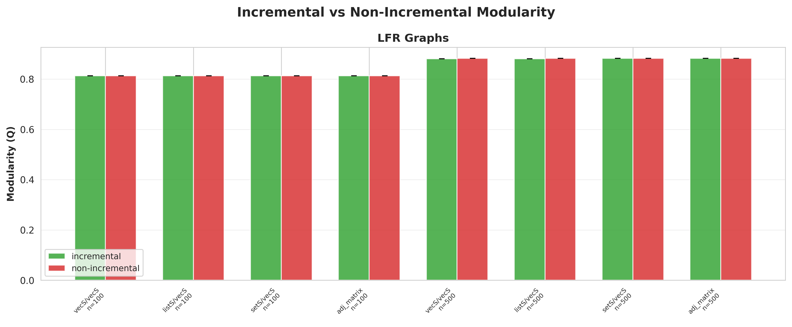

# BGL Louvain Benchmark

Compares BGL's `louvain_clustering` against NetworkX, igraph, and
gen-louvain across four BGL graph-type variants.

## Usage

```bash
./run_benchmark.sh          # full suite (~2-3 h)
./run_benchmark.sh --quick  # smoke-test (~1 min)
```

**Requires:** Python 3.8+, CMake 3.15+, C++17 compiler, Boost headers.
The script handles venv creation, dependency install, and C++ compilation.

Override the BGL include path:
```bash
cd build && cmake ../src -DBGL_GRAPH_INCLUDE=/path/to/graph/include
```

## Results

### Correctness

Distribution of modularity scores across repeated trials on several small graphs, showing whether each implementation converges to similar partition quality.


Distribution of community counts across repeated trials, revealing how consistently each implementation splits the graph.


Per-implementation deviation from the cross-implementation mean modularity, highlighting which implementations tend to find better or worse partitions.


Same relative comparison but for the number of communities detected.


Direct percentage difference between each BGL variant's modularity and each reference implementation (NetworkX, igraph, genlouvain), to verify BGL produces competitive partition quality.


### Runtime

Wall-clock time vs graph size (log-log) on LFR and scale-free graphs side by side, measuring how each implementation's runtime scales.


Number of communities detected vs graph size on both graph types, checking that implementations agree on partition granularity as graphs grow.


Speedup of each implementation relative to igraph, showing which are faster (>1) or slower (<1) across graph sizes.


### Incremental vs Non-Incremental Quality Function

Speedup gained by the incremental quality function (O(degree) per candidate move) over the non-incremental path (full O(E) modularity recomputation), for each BGL graph-type variant.


Absolute runtime comparison between incremental and non-incremental modes, showing the wall-clock cost difference on small graphs.


Modularity achieved by both modes, verifying that the incremental optimisation does not change the final partition quality.

