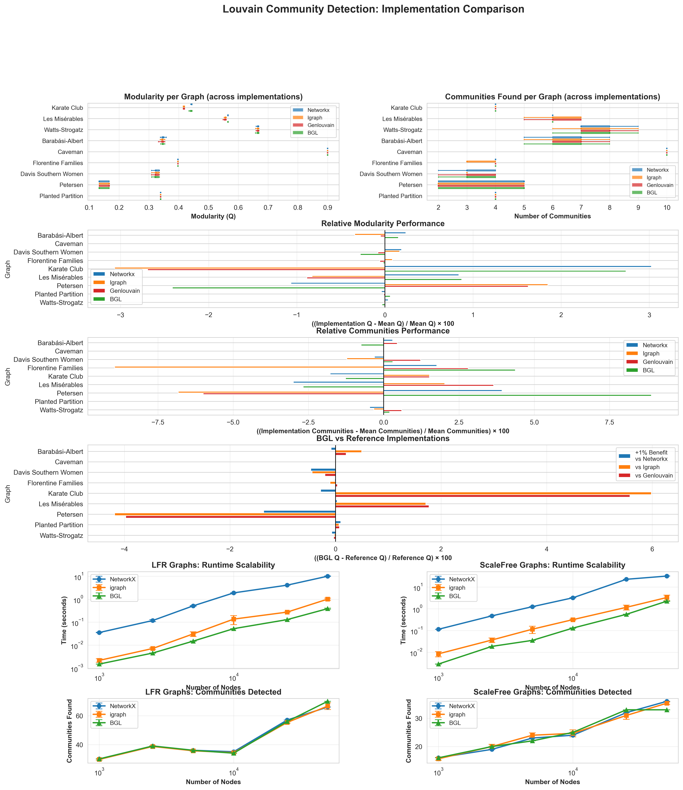
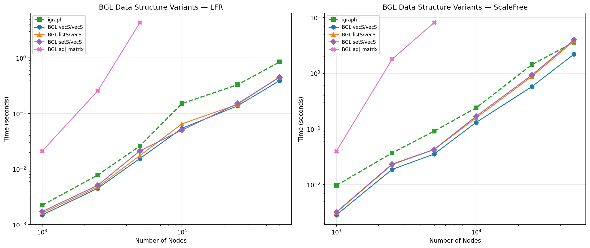
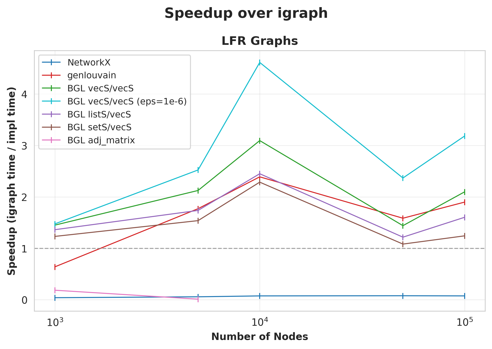
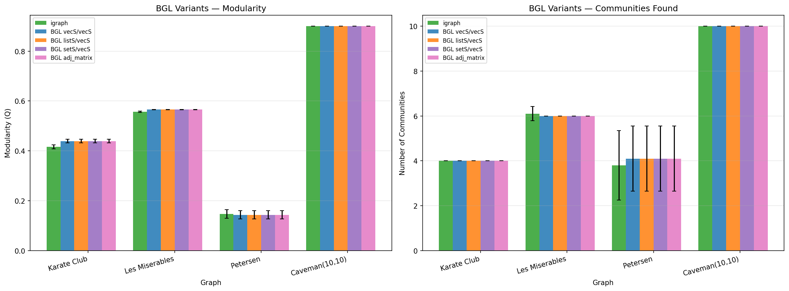

# BGL Louvain Benchmark Suite

Self-contained benchmark comparing BGL's `louvain_clustering` against NetworkX,
igraph, and gen-louvain on a set of standard community-detection graphs.

## Quick Start

```bash
cd louvain
./run_benchmark.sh
```

This will:
1. Create a Python virtual environment and install dependencies
2. Build all BGL graph-type variants via CMake
3. Run correctness + runtime benchmarks
4. Generate visualisation plots in `results/`

**Total runtime: ~30 seconds**

## Directory Layout

```
louvain/
  run_benchmark.sh        # One-command entry point
  requirements.txt        # Python deps (igraph; common deps in ../requirements-common.txt)
  src/                    # C++ sources + CMake
    CMakeLists.txt
    bgl_louvain_benchmark.hpp   # Shared template header
    bgl_louvain_vecS_vecS.cpp   # vecS/vecS
    bgl_louvain_listS_vecS.cpp  # listS/vecS
    bgl_louvain_setS_vecS.cpp   # setS/vecS
    bgl_louvain_matrix.cpp      # adjacency_matrix
  scripts/                # Python scripts
    benchmark.py          # Main benchmark runner
    visualize.py          # Plot generator
  vendor/                 # Third-party implementations
    gen-louvain/          # Auto-built from SourceForge with timing patch
      build.sh            # Downloads and patches source (CMake compiles)
      timing.patch        # Adds std::chrono LOUVAIN_TIME instrumentation
  build/                  # CMake build output  (gitignored)
  results/                # CSV output (gitignored), PNG plots (committed)
  venv/                   # Python virtualenv    (gitignored)
```

## Requirements

**Handled automatically by `run_benchmark.sh`:**
- Python 3.8+ (creates venv)
- NetworkX, igraph, pandas, matplotlib, seaborn, numpy

**For C++ compilation:**
- CMake 3.15+
- C++14 compiler
- Boost headers (system install)
- Boost.Graph fork with `louvain_clustering.hpp`
  (default path: `../../forks/graph/include`, override with
  `cmake ../src -DBGL_GRAPH_INCLUDE=/your/path`)

## Manual Steps

### Build C++ binaries only
```bash
cd louvain
mkdir -p build && cd build
cmake ../src -DCMAKE_BUILD_TYPE=Release
cmake --build . -j$(nproc)
```

### Run benchmark without the wrapper script
```bash
cd louvain
./venv/bin/python3 scripts/benchmark.py
./venv/bin/python3 scripts/visualize.py
```

## BGL Graph-Type Variants

The benchmark builds five executables from thin `.cpp` wrappers that
instantiate the shared `bgl_louvain_benchmark.hpp` template:

| Binary | OutEdgeList | VertexList |
|--------|------------|------------|
| `bgl_louvain_vecS_vecS` | vecS | vecS |
| `bgl_louvain_listS_vecS` | listS | vecS |
| `bgl_louvain_setS_vecS` | setS | vecS |
| `bgl_louvain_matrix` | adjacency_matrix | — |

## Results

### Runtime comparison



### BGL graph-type variants







## Benchmark Graphs

| Graph | Nodes | Type |
|-------|-------|------|
| Karate Club | 34 | Generated (NetworkX) |
| Les Misérables | 77 | Generated (NetworkX) |
| Watts-Strogatz | 100 | Generated (NetworkX) |
| Barabási-Albert | 100 | Generated (NetworkX) |
| Caveman | 50 | Generated (NetworkX) |
| Planted Partition | 100 | Generated (NetworkX) |

## Troubleshooting

**"gen-louvain binaries not found"** -- `run_benchmark.sh` auto-downloads,
patches (adds `std::chrono` timing), and builds gen-louvain from source.
If the download fails (e.g. no internet), gen-louvain is skipped.
To rebuild: delete `louvain/build/genlouvain_*` and re-run `run_benchmark.sh`.

**"CMake build failed"** — Ensure Boost headers are installed and
`BGL_GRAPH_INCLUDE` points to the fork's `include/` directory.

**"ModuleNotFoundError"** — Run `./run_benchmark.sh` to auto-create the
venv, or manually: `./venv/bin/pip install -r requirements.txt`.
