# BGL Louvain Benchmark

Compares BGL's `louvain_clustering` against NetworkX, igraph, and
gen-louvain across four BGL graph-type variants.

## Usage

```bash
./run_benchmark.sh          # full suite (~2-3 h)
./run_benchmark.sh --quick  # smoke-test (~1 min)
```

**Requires:** Python 3.8+, CMake 3.15+, C++17 compiler, Boost headers.
The script handles venv creation, dependency install, and C++ compilation.

Override the BGL include path:
```bash
cd build && cmake ../src -DBGL_GRAPH_INCLUDE=/path/to/graph/include
```

## Results

### Correctness

Distribution of modularity scores across repeated trials on several small graphs, showing whether each implementation converges to similar partition quality.
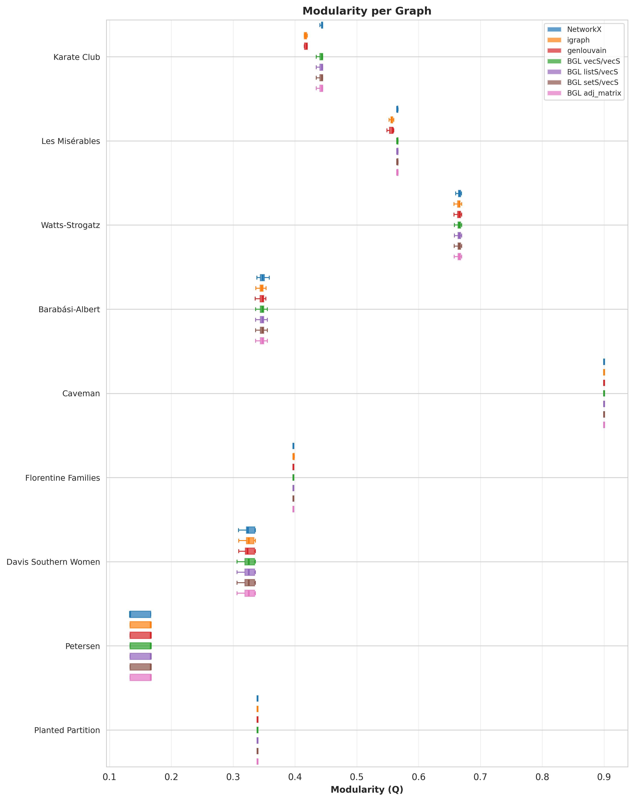

Distribution of community counts across repeated trials, revealing how consistently each implementation splits the graph.
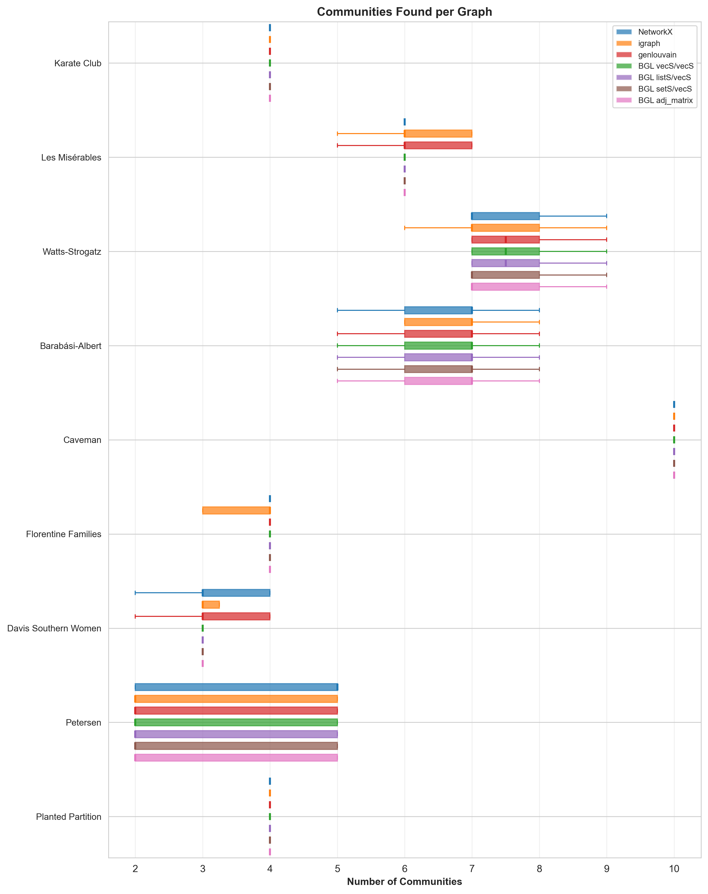

Per-implementation deviation from the cross-implementation mean modularity, highlighting which implementations tend to find better or worse partitions.
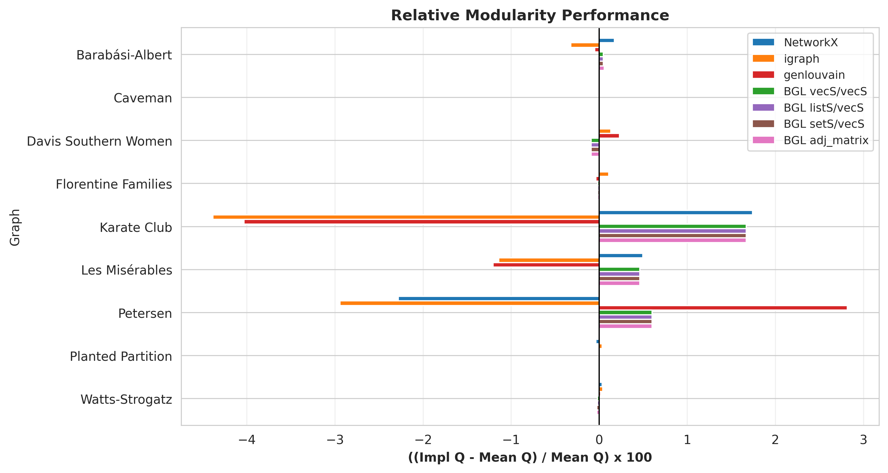

Same relative comparison but for the number of communities detected.
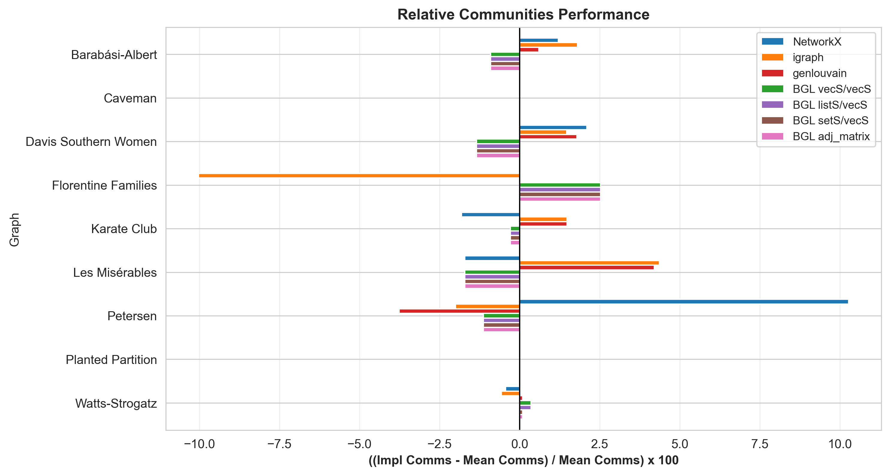

Direct percentage difference between each BGL variant's modularity and each reference implementation (NetworkX, igraph, genlouvain), to verify BGL produces competitive partition quality.
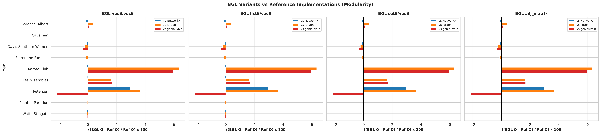

### Runtime

Wall-clock time vs graph size (log-log) on LFR benchmark graphs, measuring how each implementation's runtime scales.
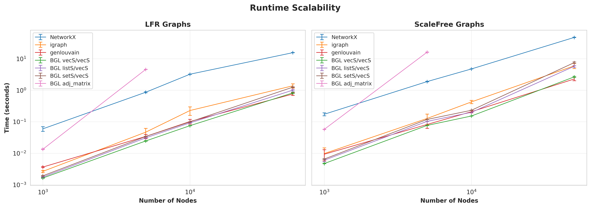

Number of communities detected vs graph size on LFR graphs, checking that implementations agree on partition granularity as graphs grow.
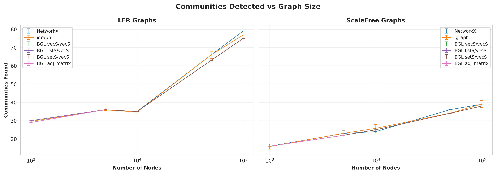

Speedup of each implementation relative to igraph, showing which are faster (>1) or slower (<1) across graph sizes.
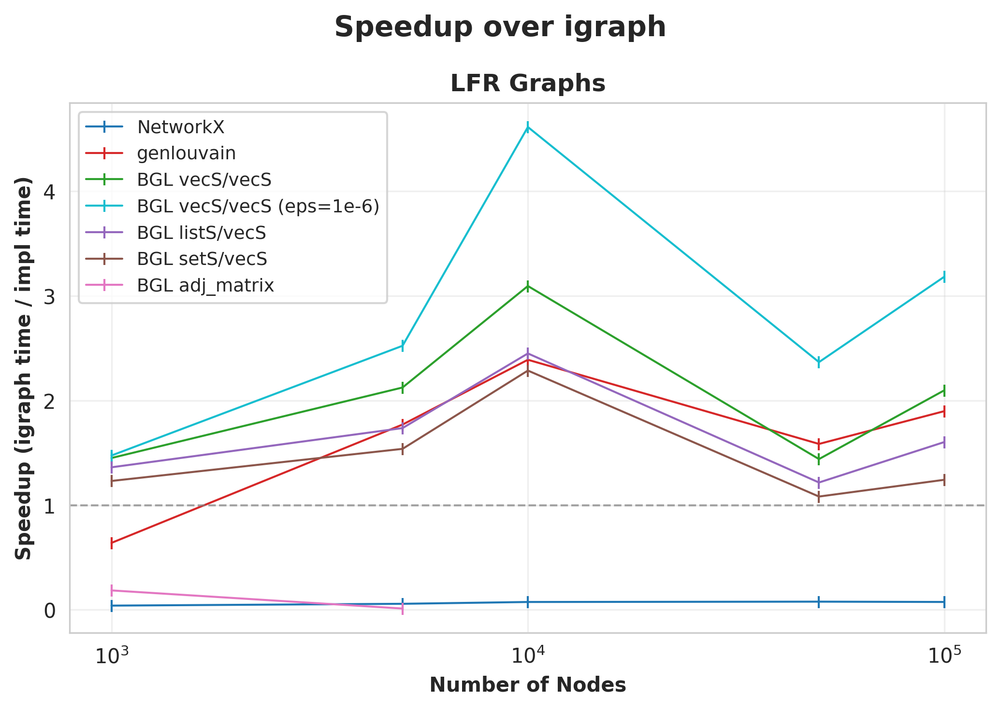

### Incremental vs Non-Incremental Quality Function

Speedup gained by the incremental quality function (O(degree) per candidate move) over the non-incremental path (full O(E) modularity recomputation), for each BGL graph-type variant.
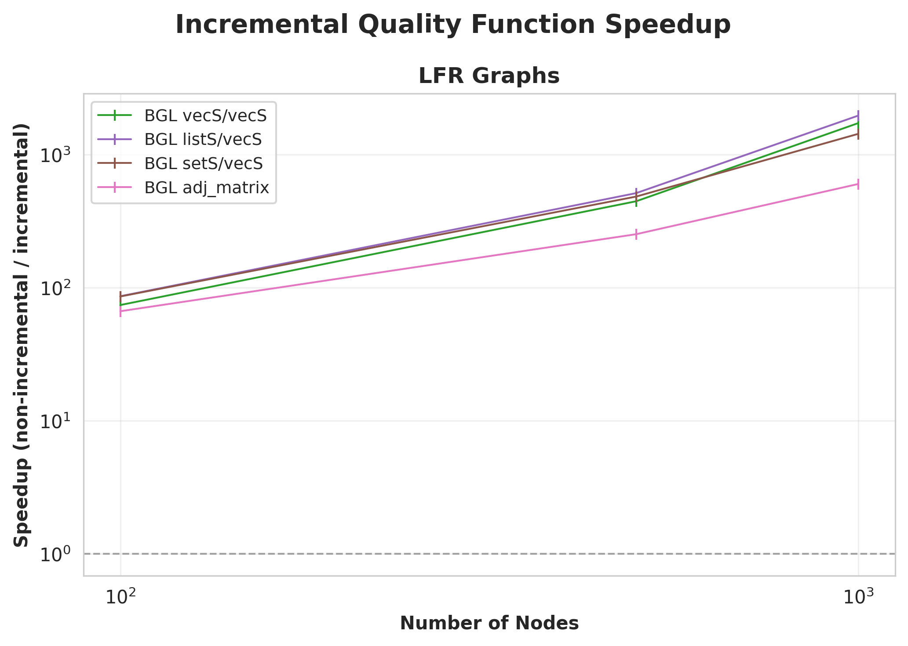

Absolute runtime comparison between incremental and non-incremental modes, showing the wall-clock cost difference on small graphs.
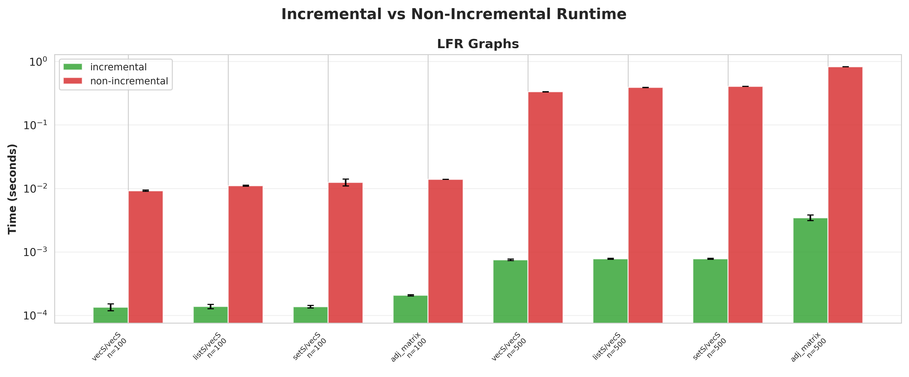

Modularity achieved by both modes, verifying that the incremental optimisation does not change the final partition quality.
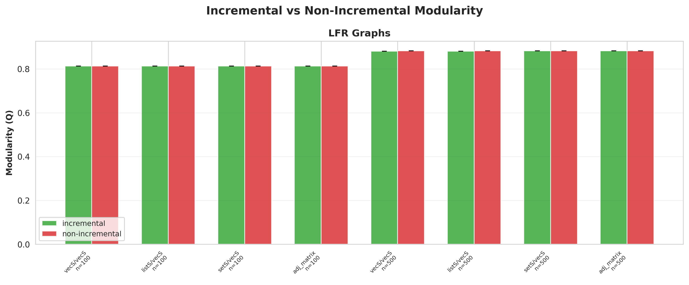

### Convergence Threshold (epsilon)

BGL defaults to eps=0 (continue until zero improvement), while genlouvain uses eps=1e-6 (stop when modularity gain < 1e-6). These plots isolate how much of the runtime gap is due to this threshold policy vs. data-structure overhead.

Speedup over igraph for BGL with both thresholds vs genlouvain, showing whether matching genlouvain's epsilon closes the performance gap.
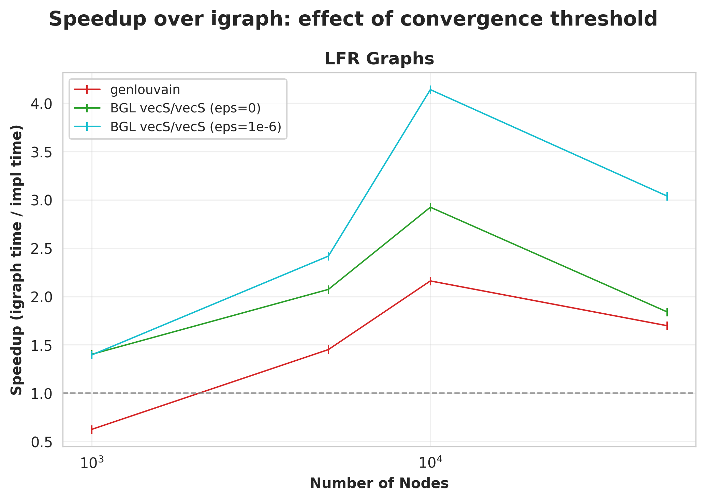

Absolute runtime comparison across graph sizes, showing the wall-clock effect of the threshold change.
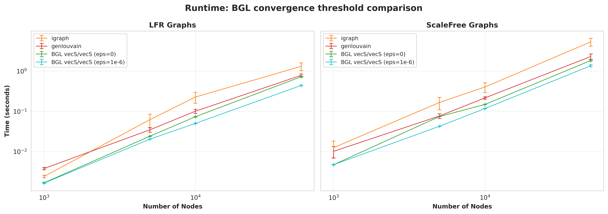

### Trust Aggregated Q vs Safe Q

BGL defaults to recomputing modularity on the original graph after each aggregation level and tracking the best partition seen (safe mode, `BOOST_GRAPH_LOUVAIN_TRUST_AGGREGATED_Q=0`). The trust mode (`=1`) skips that recheck and accepts the aggregated Q directly. These plots measure whether trusting the coarsened-graph Q is faster and whether it hurts partition quality.

Absolute runtime comparison between safe and trust-Q modes for each BGL graph-type variant across graph sizes.
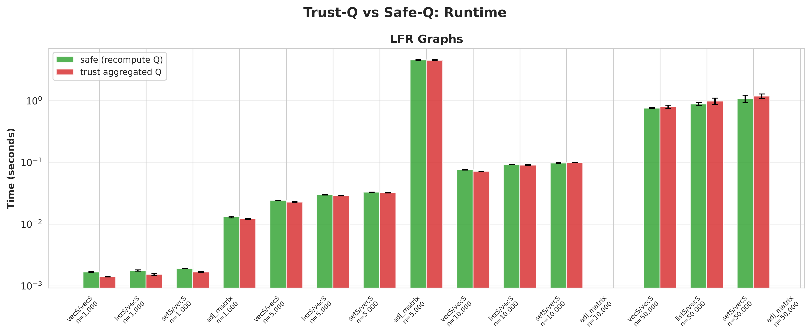

Modularity achieved by both modes, verifying whether skipping the per-level recheck degrades partition quality.
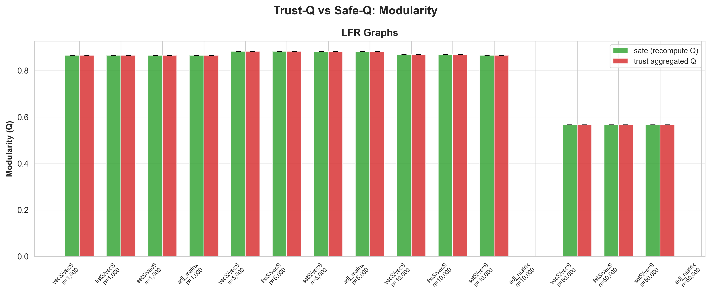

Speedup of trust-Q over safe mode per variant, showing the cost of the per-level Q recomputation.
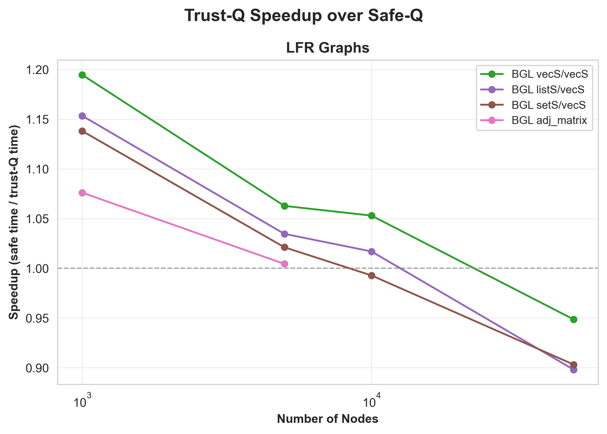

### Ablation: Trust-Q × Track-Peak-Q

`louvain_clustering` exposes two compile-time toggles that control the outer loop:

| Macro | Default | Effect |
|---|---|---|
| `BOOST_GRAPH_LOUVAIN_TRUST_AGGREGATED_Q` | 0 | When 1, use `Q_agg` from the coarsened graph directly instead of recomputing Q on the original graph (saves one O(V₀+E₀) traversal per outer iteration). |
| `BOOST_GRAPH_LOUVAIN_TRACK_PEAK_Q` | 0 | When 1, keep a copy of the best partition seen across levels and restore it at the end (adds one O(V₀) copy per iteration where Q improves). |

The previous trust-Q benchmark showed it was initially more efficient but the safe/trust performance ratio dropped below 1 for larger graphs, which is counter-intuitive. This ablation disentangles the two effects by benchmarking all four combinations independently:

| Config | TRUST_AGGREGATED_Q | TRACK_PEAK_Q |
|---|---|---|
| baseline | 0 | 0 |
| trust-Q | 1 | 0 |
| peak-Q | 0 | 1 |
| trust+peak | 1 | 1 |

Absolute runtime of all four modes for each BGL graph-type variant across graph sizes, showing which toggle(s) add or save time.
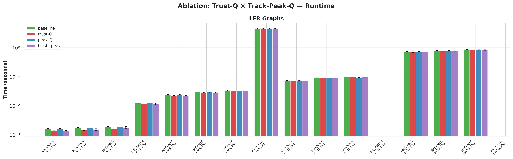

Modularity achieved by all four modes, verifying whether each toggle changes the final partition quality.
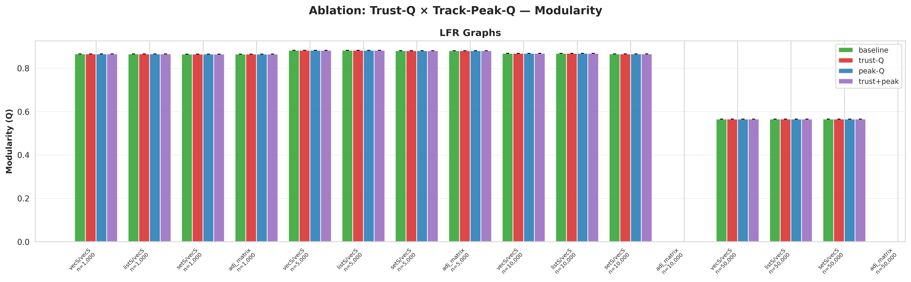

Speedup of each mode relative to baseline (>1 = faster), per variant across graph sizes — the key plot for understanding which toggle helps at which scale.
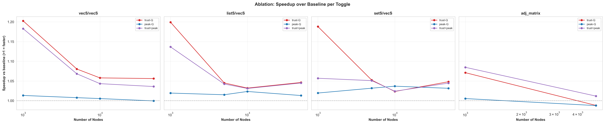

Modularity delta vs baseline (positive = better Q), showing whether skipping the recheck or tracking the peak hurts or helps partition quality.
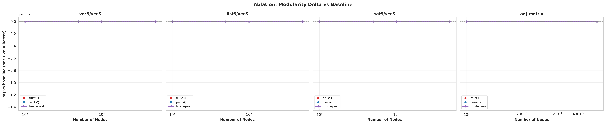

Heatmap summary of speedup vs baseline across all variant × size × mode combinations for a quick overview.
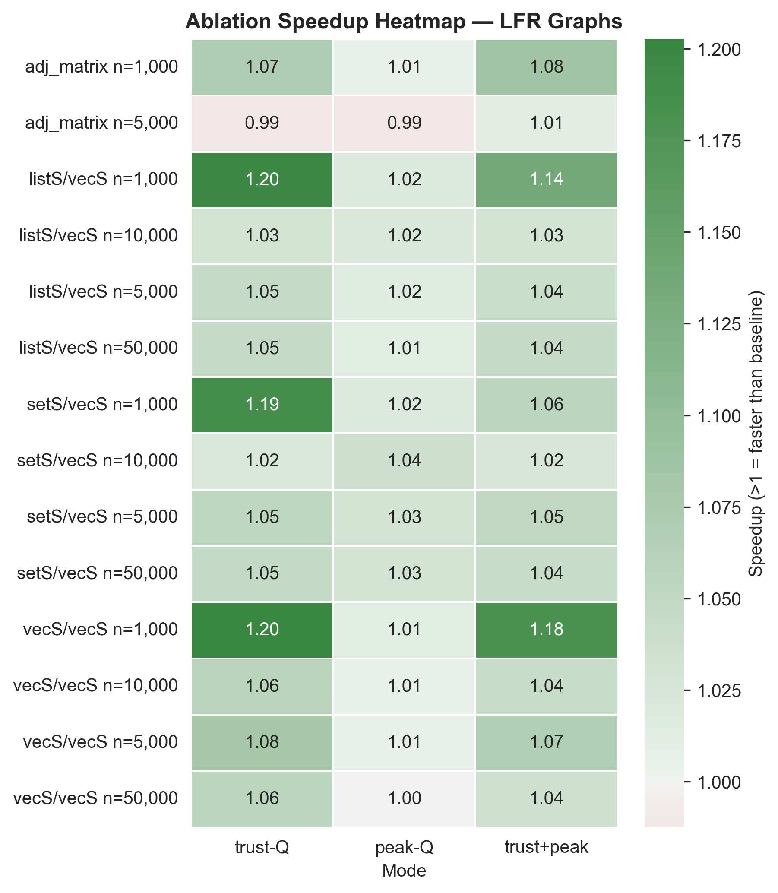
